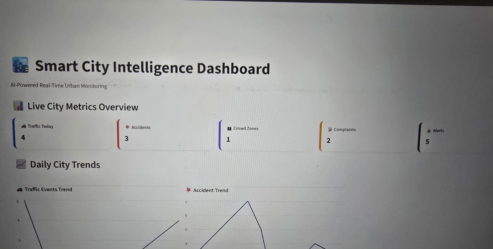
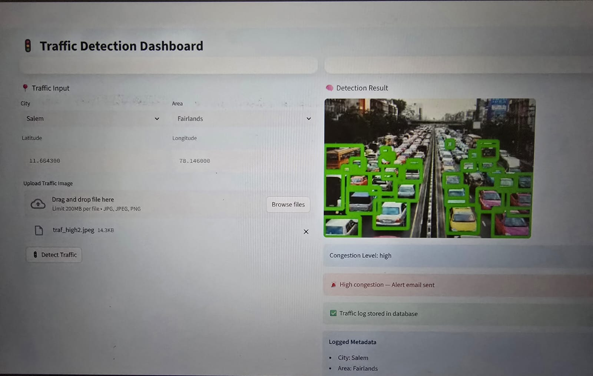
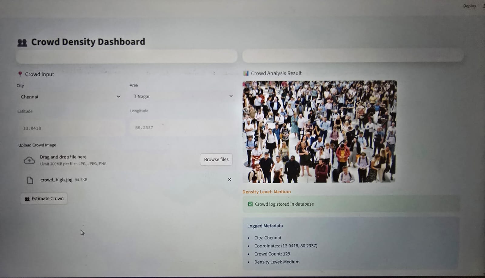
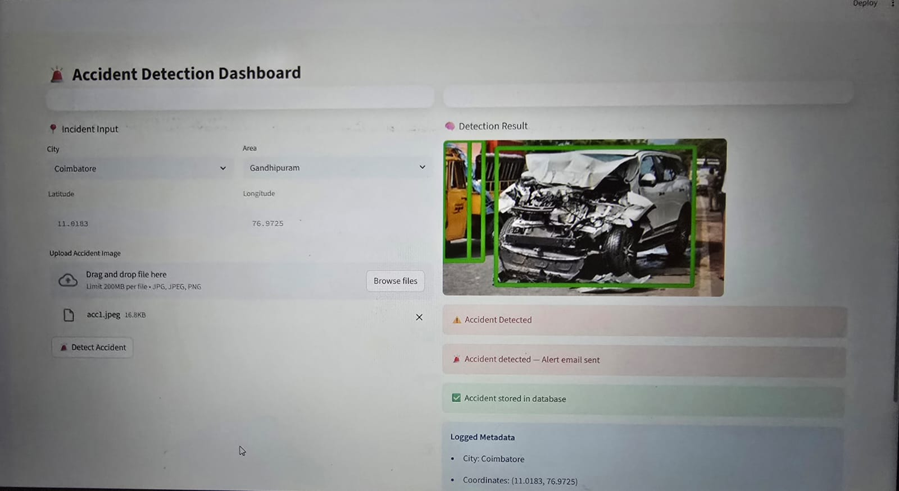
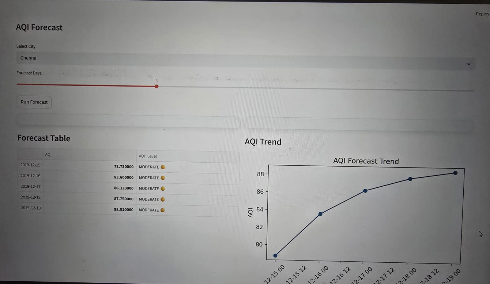
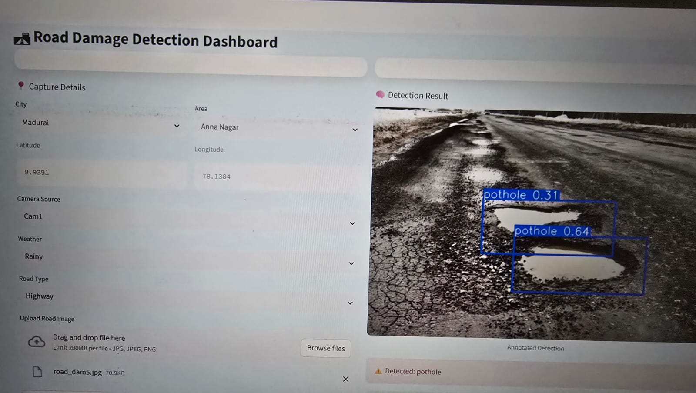
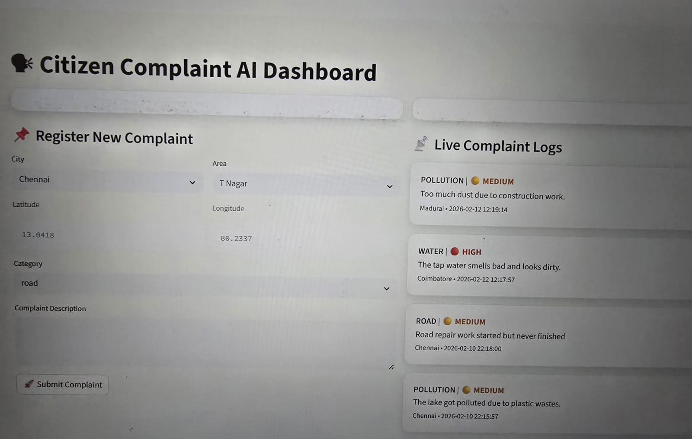
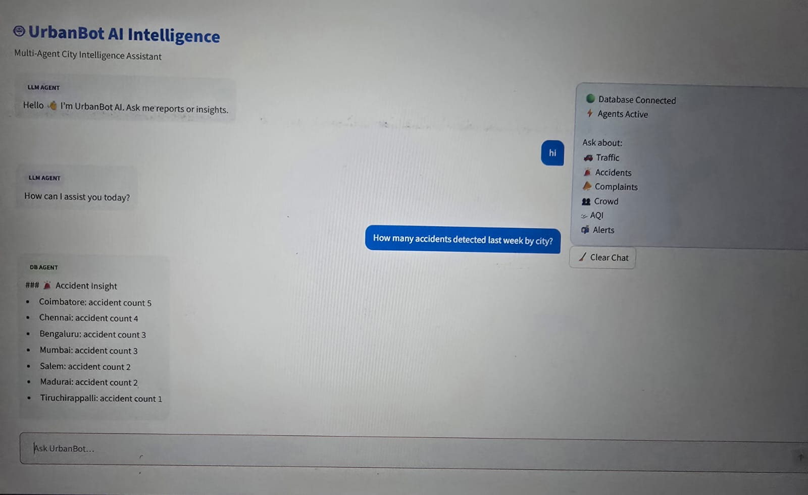

# 🌆 UrbanBot — AI Powered Urban Monitoring & Analytics System

UrbanBot is a smart urban monitoring and analytics platform that provides structured dashboards, machine learning predictions, and real-time-style city data insights.  
It integrates multiple urban domains such as traffic, crowd density, AQI, accidents, alerts, and complaints into a unified multi-page dashboard.  
The system is designed to support data-driven decision making for smart city analysis and monitoring.  
UrbanBot is deployed on AWS EC2 for scalable and remote dashboard access.

---

## 🚀 Key Features

- Unified smart city monitoring dashboard
- Traffic, crowd, AQI, accident, alerts, and complaint modules
- Clean, structured domain-specific tables
- ML-based prediction and trend analysis
- Interactive charts and visual analytics
- Database-driven storage and retrieval
- Modular multi-page Streamlit interface
- AI-assisted reporting workflows
- Cloud deployed on AWS EC2 for remote access and scalability

---

## 🖥️ Dashboard Modules

### Main Dashboard

The main dashboard provides a centralized overview of all urban intelligence modules.  
It displays key indicators, recent records, and trend summaries in one place.  
Users can quickly understand system-wide city conditions.  

---

### Traffic Monitoring

The traffic page analyzes congestion levels across areas and time periods.    
Trend visuals support pattern recognition.  
Useful for traffic planning and analysis.

---

### Crowd Density

This module tracks crowd density levels across monitored locations.  
Density is categorized for quick interpretation.    
Supports safety and event monitoring.

---

### Accident Records

The accident page logs incidents with severity classification.  
Structured tables enable fast filtering and review.  
Helps identify risk-prone zones.  
Supports response planning and analysis.

---

### AQI Monitoring

The AQI module tracks air quality values with category labels.  
Raw AQI values are converted into readable categories.  
Trend charts show environmental patterns.  
Supports environmental awareness and monitoring.

---

### Infrastructure Monitoring

The road damage module records and tracks reported road issues across locations.  
This helps identify high-risk zones and maintenance priorities.  
Supports smarter infrastructure planning and repair scheduling.

---

### Citizen Complaints

The citizen complaints page manages public issue reports by department and priority.  
Each record includes location, category, and urgency level.  
Structured tables help teams filter and respond efficiently.  

---

### LLM Chatbot Assistant

The LLM chatbot module provides an AI-powered query and reporting assistant.  
Users can ask natural language questions about urban data and trends.  
It generates intelligent summaries and insights from the database.  
Enhances usability through conversational analytics access.

---

### Alerts System

The alerts module displays generated and reported alerts.  
Each alert includes location, message, and severity.  
Helps quickly identify critical situations.  
Designed for fast operational response.

---

## 🛠️ Tech Stack

- Python
- Streamlit
- MySQL
- Pandas / NumPy
- Scikit-learn
- Matplotlib
- Machine Learning models
- AWS EC2 (deployment)

---

## 🏗️ System Architecture

UrbanBot follows a layered modular architecture:

1. **Data Layer** — Structured urban datasets stored in MySQL and AWS RDS 
2. **Processing Layer** — Data cleaning and transformation using Pandas  
3. **ML Layer** — Prediction models trained on historical patterns  
4. **Application Layer** — Streamlit multi-page dashboard modules  
5. **Visualization Layer** — Charts, tables, and analytics panels  
6. **Cloud Layer** — Hosted on AWS EC2 for remote access and scalability  

This architecture supports modular expansion and maintainability.

---

## ☁️ Cloud Deployment

UrbanBot is deployed on an AWS EC2 virtual machine.  
The Streamlit dashboard runs as a hosted web application on the EC2 server.  
All data processing and ML predictions execute server-side.  
This enables centralized access, scalability, and remote monitoring.

---

## 👤 Author

**Priya K**  
Smart City Systems & AI Dashboard Developer  
UrbanBot Project Creator

